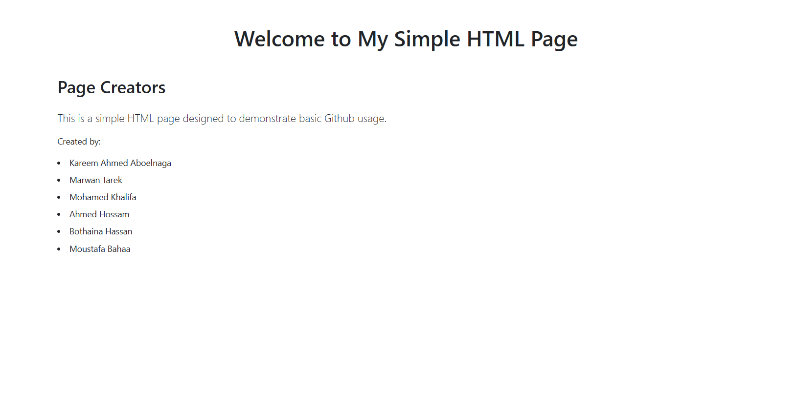

# 🌐 Simple HTML Page

A basic HTML webpage created to demonstrate GitHub usage, HTML structure, and simple content layout.



## 🧾 Description

This project includes a single HTML file that showcases:

- HTML5 boilerplate structure
- Linked external CSS
- Semantic HTML tags (`<header>`, `<main>`, `<section>`)
- A short contributors list

It's perfect for practicing version control basics with Git and GitHub.

---

## 📁 Project Structure

project-root/
│
├── index.html # Main HTML page
├── readme.md
└── screenshot.png # Project image or screenshot

yaml
Copy
Edit

---

## 🧑‍💻 Page Creators

- **Kareem Ahmed Aboelnaga**

---

## 🖼️ Screenshot

> _Preview of the webpage:_


---

## 🚀 How to Run

To view the HTML page:

1. **Clone the repository**
   ```bash
   git clone https://github.com/KAboelnaga/Github_Lab2.git
   cd your-repo-name
Open index.html in your browser

Double-click the file

Or use a live server (like in VS Code) for better testing

🎨 Customization
You can modify:

styles.css to update styling

index.html to change content or structure

Add more contributors, sections, or images

📜 License
This project is open-source and available under the MIT License.

⭐️ Give it a Star!
If you find this helpful or want to support, feel free to ⭐️ star the repository on GitHub.

Let me know if you want me to include a sample `styles.css`, or generate a screenshot image for the preview.
